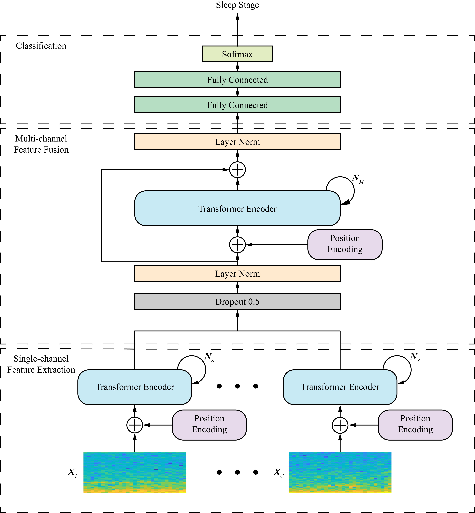

# MultiChannelSleepNet
### MultiChannelSleepNet: A Transformer-based Model for Automatic Sleep Stage Classification with PSG 
#### *by: Yang Dai, Xiuli li, Shanshan Liang, Lukang Wang, Qingtian Duan, Hui Yang, Chunqing Zhang, Xiaowei Chen, Longhui Li\*, Xingyi Li\*, and Xiang Liao\* 
This work has been accepted for publication in [IEEE Journal of Biomedical and Health Informatics (JBHI).](https://ieeexplore.ieee.org/document/10146380)

## Abstract

Automatic sleep stage classification plays an essential role in sleep quality measurement and sleep disorder diagnosis. Although many approaches have been developed, most use only single-channel electroencephalogram signals for classification. Polysomnography (PSG) provides multiple channels of signal recording, enabling the use of the appropriate method to extract and integrate the information from different channels to achieve higher sleep staging performance. We present a transformer encoder-based model, MultiChannelSleepNet, for automatic sleep stage classification with multichannel PSG data, whose architecture is implemented based on the transformer encoder for single-channel feature extraction and multichannel feature fusion. In a single-channel feature extraction block, transformer encoders extract features from time-frequency images of each channel independently. Based on our integration strategy, the feature maps extracted from each channel are fused in the multichannel feature fusion block. Another set of transformer encoders further capture joint features, and a residual connection preserves the original information from each channel in this block. Experimental results on three publicly available datasets demonstrate that our method achieves higher classification performance than state-of-the-art techniques. MultiChannelSleepNet is an efficient method to extract and integrate the information from multichannel PSG data, which facilitates precision sleep staging in clinical applications.

## Requirmenets:
- python3.6
- pytorch=='1.9.1'
- numpy
- sklearn
- scipy=='1.5.4'
- mne=='0.23.4'
- tqdm

## Data
We used three public datasets in this study:

- SleepEDF-20 (The first 39 records in SleepEDF-78)
- [SleepEDF-78](https://physionet.org/content/sleep-edfx/1.0.0/)
- [SHHS](https://sleepdata.org/datasets/shhs)

This project currently only provides pre-processing code for SleepEDF-20 and SleepEDF-78, and only provides code for sample-wise k-fold cross-validation. We will update the code in the future.  
After downloading the datasets, please place them in the folder with the corresponding name in the directory `dataset`.  
You can run the `dataset_prepare.py` to extract events from the original record (.edf)

## Reproducibility
If you want to update the training parameters, you can edit the `args.py` file. In this file, you can update:

- Device (GPU or CPU).
- Batch size.
- Number of folds (as we use K-fold cross validation).
- The number of training epochs.
- Parameters in our model (dropout rate, number of transformer encoder, etc)

To easily reproduce the results you can follow the next steps:  

1. Run `dataset_prepare.py` to extract events from the original record (.edf).
2. Run `data_preprocess_TF` to preprocess the data. The original signals will be converted to time-frequency images, and normalized.
3. Run `Kfold_trainer.py` to perform the standard K-fold cross validation.
4. Run `result_evaluate.py` to get the evaluation report. It concludes the various valuation metrics we described in paper.  

## Contact
Yang Dai  
Center for Neurointelligence, School of Medicine  
Chongqing University, Chongqing 400030, China  
Email: valar_d@163.com
